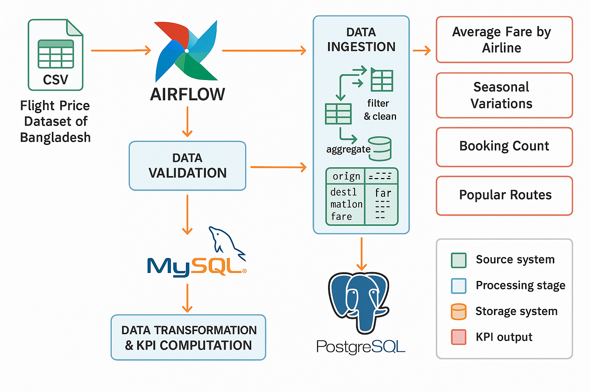

# Flight Price Analysis - Airflow Pipeline

## Pipeline Architecture and Execution Flow

### Overview
This project implements an end-to-end data pipeline using Apache Airflow to process and analyze flight price data for Bangladesh. The pipeline follows an ETL (Extract, Transform, Load) pattern with four main components:

1. **Data Ingestion**: Extracting data from CSV files into a MySQL staging database
2. **Data Validation**: Ensuring data quality and consistency
3. **Data Transformation & KPI Computation**: Calculating key performance metrics
4. **Data Loading**: Transferring the analytical results to PostgreSQL

### Architecture Diagram



### Directory Structure
```
flight_price_analysis/
├── docker-compose.yml        # Docker configuration for services
├── .gitignore                
├── dags/                     # Airflow DAG definitions
│   ├── flight_price_pipeline.py        # Main DAG definition
│   ├── data/                     # Data directory for CSV files
│   |   └── Flight_Price_Dataset_of_Bangladesh.csv
│   └── tasks/                # Task modules
│       ├── __init__.py
│       ├── data_ingestion.py           # CSV to MySQL ingestion
│       ├── data_validation.py          # Data validation tasks
│       ├── data_transformation.py      # KPI computation
│       ├── data_loading.py             # PostgreSQL loading
│       └── utils/
│           ├── __init__.py
│           ├── logging_config.py        # Logging configuration
│           └── error_handling.py        # Error handling utilities
├── sql/                      # SQL scripts
│   ├── mysql/
│   │   └── init.sql                    # MySQL schema initialization
│   └── postgres/
│       └── init.sql                    # PostgreSQL schema initialization
├── logs/                     # Airflow and custom logs
├── visuals/                  # Screenshots of dags in Airflow Ui and databases
└── README.md                 # Project documentation
```

## Airflow DAG and Tasks Description

### Main DAG: flight_price_pipeline

The pipeline consists of four sequential tasks:

1. **ingest_data**
   - **Function**: `csv_to_mysql`
   - **Purpose**: Reads CSV file and loads into MySQL staging table
   - **Parameters**:
     - `csv_path`: Path to the CSV file
     - `mysql_conn_id`: Airflow connection ID for MySQL
     - `table_name`: Target MySQL table name

2. **validate_data**
   - **Function**: `validate_flight_data`
   - **Purpose**: Validates data quality and consistency
   - **Parameters**:
     - `mysql_conn_id`: Airflow connection ID for MySQL
     - `table_name`: MySQL table name containing data to validate

3. **transform_data**
   - **Function**: `transform_and_compute_kpis`
   - **Purpose**: Transforms data and computes KPIs
   - **Parameters**:
     - `mysql_conn_id`: Airflow connection ID for MySQL
     - `table_name`: MySQL table name containing validated data

4. **load_data**
   - **Function**: `load_data_to_postgres`
   - **Purpose**: Transfers KPI results to PostgreSQL
   - **Parameters**:
     - `mysql_conn_id`: Airflow connection ID for MySQL
     - `postgres_conn_id`: Airflow connection ID for PostgreSQL

### Task Dependencies
```
ingest_data >> validate_data >> transform_data >> load_data
```

## KPI Definitions and Computation Logic

### 1. Average Fare by Airline
- **Definition**: Mean base fare and total fare for each airline
- **Computation**: 
  ```python
  airline_metrics = df.groupby('Airline').agg(
      avg_base_fare=('Base_Fare_BDT', 'mean'),
      avg_total_fare=('Total_Fare_BDT', 'mean'),
      booking_count=('Airline', 'count')
  )
  ```

### 2. Seasonal Fare Variation
- **Definition**: Comparison of average fares across different seasons
- **Computation**:
  ```python
  seasonal_metrics = df.groupby(['Seasonality', 'Airline']).agg(
      avg_fare=('Total_Fare_BDT', 'mean'),
      booking_count=('Airline', 'count')
  )
  ```

### 3. Booking Count by Airline
- **Definition**: Number of bookings per airline
- **Computation**: Included as part of the airline_metrics calculation

### 4. Most Popular Routes
- **Definition**: Top source-destination pairs ranked by booking count
- **Computation**:
  ```python
  route_metrics = df.groupby(['Source', 'Source_Name', 'Destination', 'Destination_Name']).agg(
      avg_fare=('Total_Fare_BDT', 'mean'),
      booking_count=('Source', 'count')
  )
  route_metrics = route_metrics.sort_values('booking_count', ascending=False)
  route_metrics['route_rank'] = range(1, len(route_metrics) + 1)
  ```

## Database Schema

### MySQL Staging Database
- **Table**: `flight_data`
  - Contains all raw data from CSV with additional processing columns
  - Key columns:
    - `id`: Auto-incrementing primary key
    - `Airline`, `Source`, `Destination`, etc.: Original CSV columns
    - `Processed`: Boolean flag indicating validation status
    - `Processing_Timestamp`: Timestamp of last processing

### PostgreSQL Analytics Database
- **Table**: `airline_metrics`
  - `id`: Serial primary key
  - `airline`: Airline name
  - `avg_base_fare`: Average base fare
  - `avg_total_fare`: Average total fare
  - `booking_count`: Number of bookings
  - `updated_at`: Last update timestamp

- **Table**: `seasonal_metrics`
  - `id`: Serial primary key
  - `seasonality`: Season category
  - `airline`: Airline name
  - `avg_fare`: Average fare during the season
  - `booking_count`: Number of bookings
  - `updated_at`: Last update timestamp

- **Table**: `route_metrics`
  - `id`: Serial primary key
  - `source`, `source_name`: Origin airport code and name
  - `destination`, `destination_name`: Destination airport code and name
  - `avg_fare`: Average fare for the route
  - `booking_count`: Number of bookings
  - `route_rank`: Popularity ranking (1 = most popular)
  - `updated_at`: Last update timestamp

## Setup and Usage Instructions

### Prerequisites
- Docker and Docker Compose
- Access to the Flight Price Dataset of Bangladesh CSV file

### Setup Steps

1. **Clone the repository**:
   ```bash
   git clone https://github.com/b-kenneth/DataEng_Phase1_labs.git 
   git checkout lab6_airflow_flight_price_analysis
   ```

2. **Create .env file**:
   ```bash
   echo "AIRFLOW_UID=$(id -u)" > .env
   ```

3. **Place the CSV file**:
   Copy the `Flight_Price_Dataset_of_Bangladesh.csv` file to the `./dags/data` directory.

4. **Start the Docker containers**:
   ```bash
   docker-compose up -d
   ```

5. **Set up Airflow connections**:
   - Access Airflow UI at http://localhost:8080
   - Navigate to Admin > Connections
   - Add MySQL connection:
     - Conn Id: `mysql_conn`
     - Conn Type: `MySQL`
     - Host: `mysql`
     - Schema: `flight_staging`
     - Login: `******`
     - Password: `******`
     - Port: `3306`
   - Add PostgreSQL connection:
     - Conn Id: `postgres_conn`
     - Conn Type: `Postgres`
     - Host: `postgres-analytics`
     - Schema: `flight_analytics`
     - Login: `******`
     - Password: `******`
     - Port: `5432`

6. **Run the pipeline**:
   - Access Airflow UI
   - Enable and trigger the `flight_price_analysis` DAG
   - Monitor task execution in the Graph or Grid view

7. **Verify results**:
   - Access the PostgreSQL database using pgAdmin (http://localhost:5050) or Adminer (http://localhost:8081)
   - Query the KPI tables to view the analytical results

### Accessing Database Management Tools
- **pgAdmin**: http://localhost:5050 (login: admin@admin.com/admin)
- **Adminer**: http://localhost:8081
  - System: PostgreSQL/MySQL
  - Server: postgres-analytics/mysql
  - Username: ******
  - Password: ******
  - Database: flight_analytics/flight_staging

## Challenges and Solutions

### Challenge 1: Database Schema Initialization
**Problem**: Initially, PostgreSQL containers were failing to start due to role/database conflicts.

**Solution**: Restructured the initialization scripts to first create users, then databases, then grant appropriate permissions. Used Docker volume mounting to ensure initialization scripts run on container creation.

### Challenge 2: CSV Data Format Handling
**Problem**: The CSV contained column names with spaces and special characters that caused SQL insertion issues.

**Solution**: Implemented column name cleaning in the data ingestion module, replacing spaces with underscores and removing special characters.

### Challenge 3: Pipeline Modularity
**Problem**: Initial implementation had tightly coupled components, making testing and maintenance difficult.

**Solution**: Restructured the codebase to use a modular approach with separate Python files for each pipeline component, and implemented utility modules for shared functionality like logging and error handling.

## Performance Considerations

1. **Chunked Processing**: Large CSV files are processed in chunks to avoid memory issues
2. **Database Transactions**: Using transactions to ensure data consistency during batch inserts/updates
3. **Incremental Processing**: Only processing unprocessed records in each pipeline run


## Visual
All visual components of this project, including screenshots of database structures, the system architecture diagram, and Airflow DAG visualizations, are available in the visuals/ folder. 