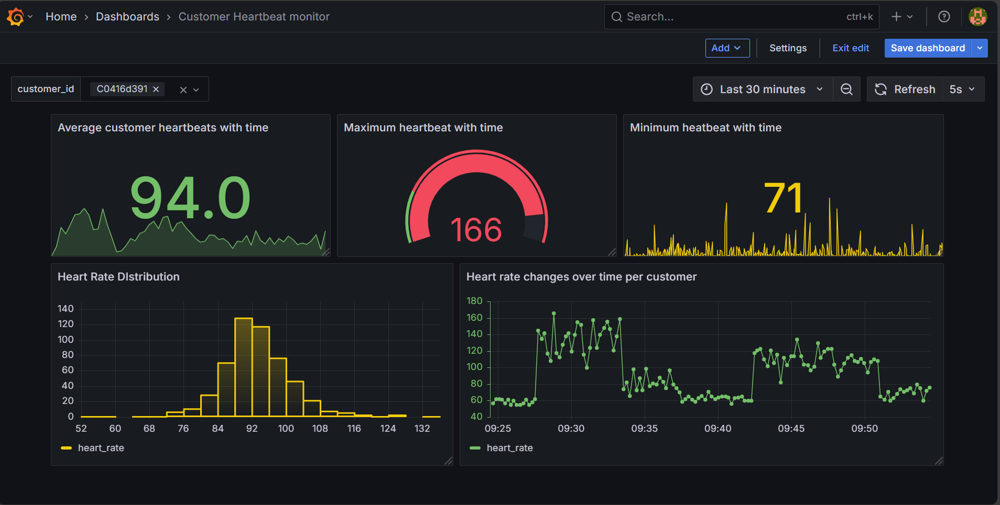
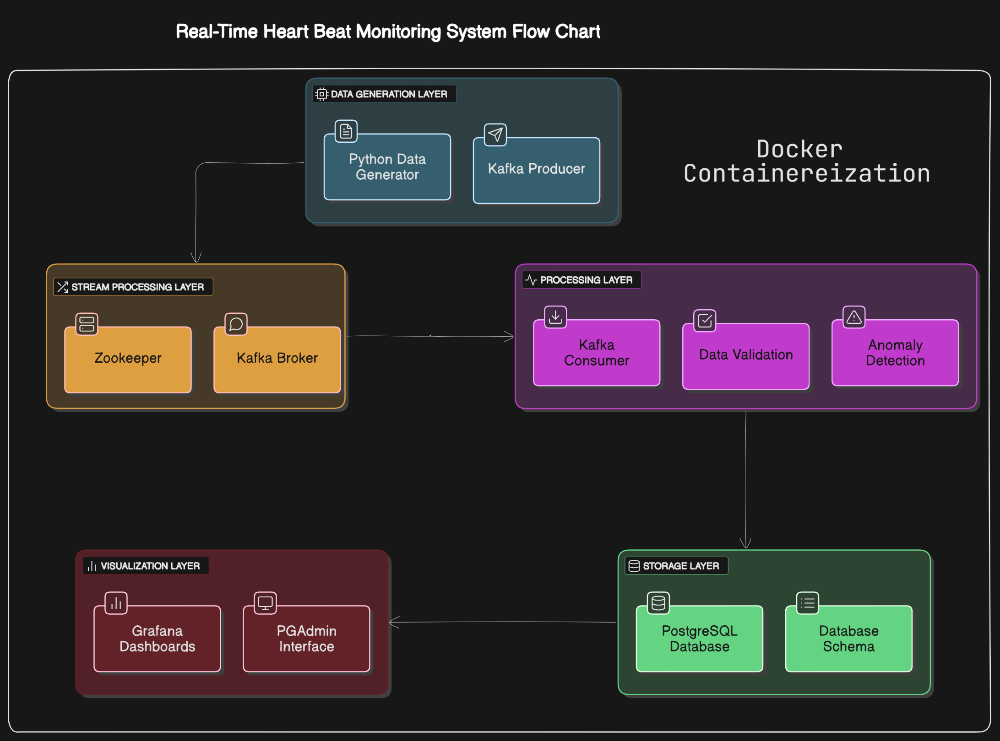

# Real-Time Customer Heart Beat Monitoring System

A data pipeline for continuous heart rate monitoring, featuring real-time data generation, Kafka streaming, PostgreSQL storage, and Grafana visualization.



## System Overview

This project implements a complete end-to-end data pipeline that:
- Generates synthetic heart rate data for multiple customers
- Streams data through Apache Kafka
- Processes and validates incoming data
- Stores readings in PostgreSQL time-series database
- Visualizes heart rate patterns in real-time through Grafana



- **Kafka**: Message broker for real-time data streaming
- **PostgreSQL**: Relational database optimized for time-series data
- **Grafana**: Dashboard for visualization and monitoring
- **PGAdmin**: Database management interface

## Prerequisites

- Docker and Docker Compose
- Git

## Directory Structure
```
heart-beat-monitoring/
│
├── db/
│   └── pgdata/                  # PostgreSQL data directory (gitignored)
│
├── schema/
│   └── init.sql                 # Database schema definition
│
├── src/
│   ├── data_generator.py        # Heart rate data simulator
│   ├── kafka_producer.py        # Sends data to Kafka
│   ├── kafka_consumer.py        # Reads from Kafka and writes to PostgreSQL
│   └── utils.py                 # Helper functions
│
├── visualization/
│   ├── flow_diagram.png         # System architecture diagram
│   ├── heart_beats_dashboard.png # Screenshot of Grafana dashboard
│   └── database_screenshot.png  # Screenshot of database records
│
├── .gitignore                   # Git ignore file
├── docker-compose.yml           # Docker Compose configuration
├── Dockerfile                   # Docker image definition
├── README.md                    # Project documentation
└── requirements.txt             # Python dependencies
```

## Setup Instructions

### 1. Clone the Repository

```bash
git clone https://github.com/b-kenneth/DataEng_Phase1_labs.git 
git checkout lab5_kafka_heart_beat_monitoring
```

### 2. Environment Configuration

Create a `.env` file in the project root with the following variables:

```
POSTGRES_USER=********
POSTGRES_PASSWORD=********
DB_NAME=********
```

### 3. Start the System

Launch all components using Docker Compose:

```bash
docker-compose up -d
```

This command starts:
- Zookeeper
- Kafka
- PostgreSQL with schema initialization
- Kafka Producer (data generator)
- Kafka Consumer (data processor)
- Grafana
- PGAdmin

### 4. Verify Services

Check that all services are running:

```bash
docker-compose ps
```

All services should show as "Up" status.

### 5. Access the Interfaces

- **Grafana Dashboard**: http://localhost:3000 
  - Username: `admin`
  - Password: `admin`

- **PGAdmin Interface**: http://localhost:8081
  - Email: `admin@admin.com`
  - Password: `admin`

### 6. Grafana Setup

1. Log in to Grafana
2. Add PostgreSQL data source:
   - Name: `PostgreSQL`
   - Host: `postgres:5432`
   - Database: `*******`
   - User: `********`
   - Password: `********`
   - SSL Mode: `disable`

3. Import the dashboard from `grafana/dashboard.json` or create your own visualizations

## System Architecture Explained

### Data Flow

1. **Data Generation**: The producer continuously generates realistic heart rate data for multiple customers, considering factors like age and activity level
   
2. **Data Ingestion**: Heart rate readings are published to a Kafka topic ('customer-heartbeats')
   
3. **Data Processing**: A consumer reads from Kafka, validates data (checking for realistic heart rate values, proper timestamps, etc.)
   
4. **Data Storage**: Valid readings are inserted into PostgreSQL's time-series optimized tables
   
5. **Visualization**: Grafana connects to PostgreSQL to provide real-time dashboards

## Monitoring and Maintenance

### Viewing Logs

To view logs for specific components:

```bash
# For data generator
docker-compose logs producer

# For data processor
docker-compose logs consumer

# For Kafka
docker-compose logs kafka
```

### Stopping the System

To stop all services:

```bash
docker-compose down
```

To completely reset the system including all data:

```bash
docker-compose down -v
```