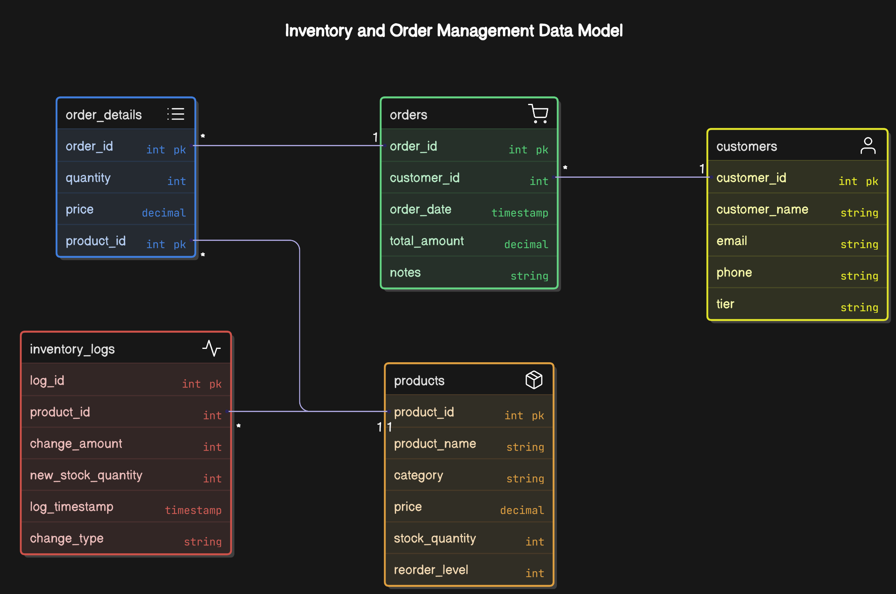

# Inventory and Order Management System

## Project Overview

This project implements a comprehensive database-driven Inventory and Order Management System for an e-commerce company. The system efficiently handles product information, customer data, order processing, and inventory tracking while providing valuable business insights and automating critical workflows.

## Features

- **Product Management**: Track products with details including stock levels and reorder points  
- **Customer Management**: Store and categorize customers based on spending patterns  
- **Order Processing**: Handle multi-product orders with automatic inventory updates  
- **Inventory Tracking**: Maintain comprehensive logs of all stock changes  
- **Business Intelligence**: Generate insights on customer spending and product inventory status  
- **Bulk Discounts**: Automatically apply discounts for large quantity orders  
- **Automated Replenishment**: Detect and replenish products with low stock  
- **Performance Optimization**: Database views and indexes for efficient data access  

## Database Schema

The system is built on five core tables with carefully designed relationships:

- **Products**: Stores product information with stock quantities and reorder levels  
- **Customers**: Maintains customer contact information  
- **Orders**: Records order details with customer references and totals  
- **Order Details**: Tracks which products were ordered in what quantities  
- **Inventory Logs**: Maintains an audit trail of all stock changes  




## Project Structure


## Setup Instructions

### Prerequisites
- Docker and Docker Compose
- PostgreSQL client (optional, for direct database access)

### Database Setup (Optional)

1. Clone this repository  
2. Navigate to the project directory  
3. Start the PostgreSQL database:
   ```bash
   docker-compose -f setup/docker-compose.yaml up -d


## Implementation Details

### Phase 1: Database Design and Schema Implementation

The system begins with a carefully designed schema that ensures data integrity through:

- **Primary and foreign keys** for maintaining relationships  
- **Check constraints** for business rule enforcement  
- **Default values** for convenience  
- **NOT NULL constraints** for data validation  
- **UNIQUE constraints** to prevent duplicates  

### Phase 2: Order Placement and Inventory Management

Order processing is implemented through a stored procedure that:

- Creates order records with customer references  
- Supports multiple products per order  
- Deducts stock quantities  
- Logs inventory changes  
- Applies bulk discounts based on order quantity  
- Calculates order totals  


### Phase 3: Monitoring and Reporting

Business insights are provided through specialized functions:

- `fn_customer_order_summary()`: Lists orders for a customer with totals and item counts  
- `fn_low_stock_report()`: Identifies products below reorder levels  
- `fn_customer_spending_tiers()`: Categorizes customers into spending tiers (Bronze/Silver/Gold)  

### Phase 4: Stock Replenishment and Automation

Workflow automation is accomplished through triggers:

- `trg_inventory_log`: Automatically logs all stock quantity changes  
- `trg_auto_replenish`: Detects low stock and automatically replenishes inventory  

### Phase 5: Advanced Queries and Optimizations

Performance is enhanced through:

- **Database views** for simplified data access:  
  - `vw_order_summary`: Summarizes order information with customer details  
  - `vw_low_stock_products`: Shows products needing replenishment  
- **Indexes** on frequently queried columns for faster data retrieval  

### Performance Considerations

The system is optimized for performance through:

- **Strategic indexing** on frequently queried columns  
- **Efficient join strategies** in views and functions  
- **Transaction handling** for data consistency  
- **Parameterized functions** for flexible reporting  

### Conclusion

This Inventory and Order Management System provides a robust foundation for e-commerce operations. By implementing core functionality in phases, the system delivers a comprehensive solution for product management, order processing, and business insights.

