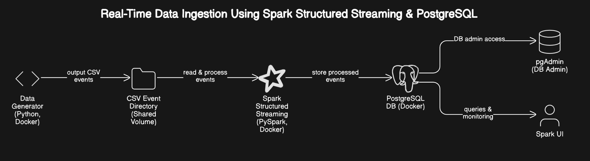

# Project Overview

## Real-Time Data Ingestion Using Spark Structured Streaming & PostgreSQL

### Project Summary

This project implements a real-time data pipeline that simulates an e-commerce platform tracking user activity. The system generates synthetic user events-such as product views and purchases-in CSV format, streams and processes them using Apache Spark Structured Streaming, and stores the cleaned data in a PostgreSQL database. The goal is to demonstrate a full-stack solution for continuous data ingestion, transformation, and storage using modern data engineering tools and techniques.

---

### System Components

#### **1. Data Generator**
- **Script:** `data_generator.py`
- **Function:** Produces fake e-commerce events in CSV files, each capturing fields like user ID, session ID, action type (view/purchase), product ID, event time, price (when applicable), and user agent.
- **Output:** Saves generated CSVs to a designated directory at regular intervals to simulate real-time event arrival.

#### **2. Spark Structured Streaming**
- **Script:** `spark_streaming_to_postgres.py`
- **Function:** Monitors the CSV event directory, detects and reads each new CSV file as it arrives, and performs necessary data transformation steps (type casting, cleaning, deduplication).
- **Processing:** Uses Spark Structured Streaming to ingest and handle data in micro-batches, with robust support for scalability and fault tolerance.

#### **3. PostgreSQL Database**
- **Setup Script:** `postgres_setup.sql`
- **Function:** Provides persistent storage for all processed event records. The schema is designed to match the event structure, with an auto-incremented primary key for integrity.
- **User Access:** Data can be viewed and queried using standard SQL tools or via a web-based database UI (such as pgAdmin).

#### **4. Orchestration & Management**
- **Docker Compose:** Brings together all services (data generator, Spark, PostgreSQL, pgAdmin) for seamless deployment, consistent networking, and persistent storage using shared Docker volumes.
- **Configuration:** Environment variables and configuration files are used to ensure portability and ease of setup.

---

### Data Pipeline Flow

1. **Event Simulation:** The data generator creates batches of fake e-commerce events in CSV files at regular time intervals, mimicking continuous user activity.
2. **Data Ingestion & Transformation:** Spark Structured Streaming continuously monitors the event directory, ingesting new CSV files as micro-batches. The data is cleaned, transformed, and prepared for storage.
3. **Storage in PostgreSQL:** The processed data is written directly into a PostgreSQL database in real time using JDBC, enabling reliable storage and subsequent analysis.
4. **Monitoring & Validation:** Data flow, transformations, and storage can be monitored via Spark UI and pgAdmin, and are validated with built-in test cases and performance checks.

---

### Key Technologies

- **Apache Spark Structured Streaming:** Real-time stream processing and transformation.
- **Python:** For data generation and scripting.
- **PostgreSQL:** Relational storage and analytics.
- **Docker Compose:** Orchestration and environment management.
- **pgAdmin:** Web-based database exploration and validation.

---

### System Architecture Diagram

---

### Summary

This project provides practical experience in designing, building, and evaluating a basic real-time data pipeline. All components are containerized for maximum portability and reproducibility. The system is tested end-to-end to ensure data is generated, ingested, processed, and stored reliably, and can be monitored and queried by the end user.
